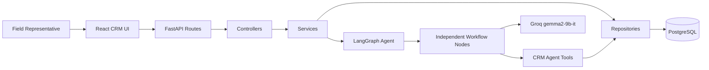
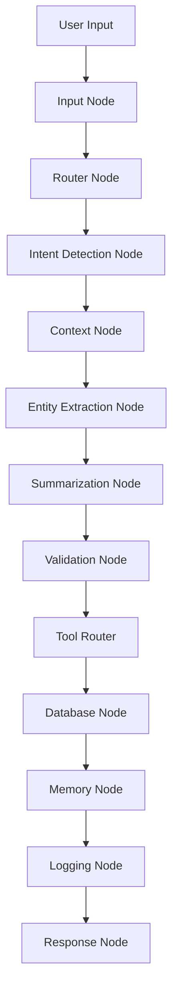
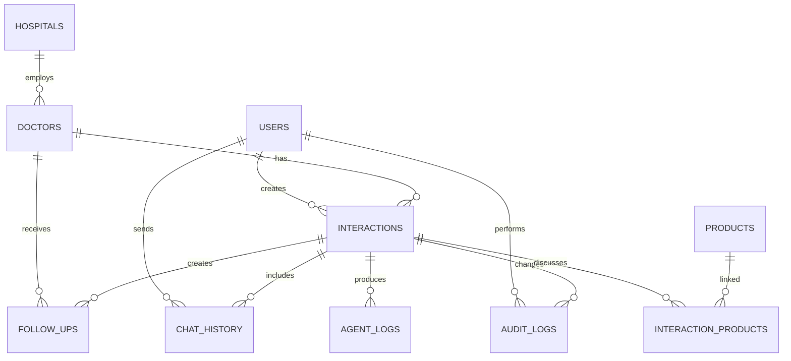

# AI-First CRM HCP Module

Enterprise-ready Healthcare Professional CRM module for pharmaceutical field representatives. The app supports structured interaction logging and an AI conversational workflow powered by a LangGraph orchestration layer and Groq models.

## What Is Included

- React, Redux Toolkit, React Router, Axios, React Hook Form, Zod, Tailwind CSS, and Inter-based frontend.
- FastAPI backend with API, controller, service, repository, and database layers.
- SQLAlchemy models for users, doctors, hospitals, interactions, products, follow-ups, chat history, agent logs, audit logs, and settings.
- LangGraph workflow with independent nodes for input, routing, intent, context, extraction, summary, validation, tool routing, database persistence, memory, logging, and response.
- Groq integration using `gemma2-9b-it`, with a deterministic extraction fallback for local development when `GROQ_API_KEY` is absent.
- Documentation for architecture, database schema, API shape, setup, assumptions, and future improvements.

## Quick Start

```bash
cp .env.example .env
docker compose up -d postgres

cd server
python -m venv .venv
.venv\Scripts\activate
pip install -r requirements.txt
uvicorn app.main:app --reload
```

```bash
cd client
npm install
npm run dev
```

Frontend: `http://localhost:5173`

Backend: `http://localhost:8000`

API docs: `http://localhost:8000/docs`

## Architecture



## LangGraph Flow



## Database Schema



## API Overview

### Authentication

- `POST /api/auth/login`
- `POST /api/auth/logout`

### Doctors

- `GET /api/hcp`
- `GET /api/hcp/{doctor_id}`
- `POST /api/hcp`

### Interactions

- `GET /api/interactions`
- `POST /api/interactions`
- `PUT /api/interactions/{interaction_id}`
- `DELETE /api/interactions/{interaction_id}`

### Chat And Agent

- `POST /api/chat`
- `POST /api/agent/process`

### Follow-ups And Dashboard

- `GET /api/followups`
- `GET /api/dashboard`

## Folder Structure

```text
client/
  src/components/
  src/pages/
  src/redux/
  src/services/
  src/types/
server/
  app/api/routers/
  app/controllers/
  app/services/
  app/repositories/
  app/database/
  app/models/
  app/schemas/
  app/langgraph/
```

## Environment Variables

- `DATABASE_URL`: PostgreSQL SQLAlchemy connection string.
- `GROQ_API_KEY`: Groq API key used by the LangGraph extraction and summarization nodes.
- `GROQ_MODEL`: Primary Groq model. Defaults to `gemma2-9b-it`.
- `GROQ_FALLBACK_MODEL`: Optional fallback model. Defaults to `llama-3.3-70b-versatile`.
- `JWT_SECRET_KEY`: Auth signing key.
- `CLIENT_ORIGIN`: Allowed frontend origin for CORS.
- `API_RATE_LIMIT_PER_MINUTE`: In-memory API throttling limit per client IP.

## Assumptions

- Authentication is architecture-ready and returns a development token for the interview assignment.
- PostgreSQL is the production database target. A SQLite URL can be supplied for fast local smoke tests.
- The AI agent never calls the LLM from the API route. All model interaction is contained inside LangGraph nodes and provider services.
- Groq failures or missing keys fall back to deterministic extraction so the CRM workflow remains testable offline.

## Future Improvements

- Add OAuth or SAML authentication for enterprise identity providers.
- Add Alembic-generated migration history for each release.
- Add field-level permission policies by role, territory, and brand team.
- Add calendar, email, and sample inventory integrations.
- Add model-evaluation fixtures for prompt regression testing.
