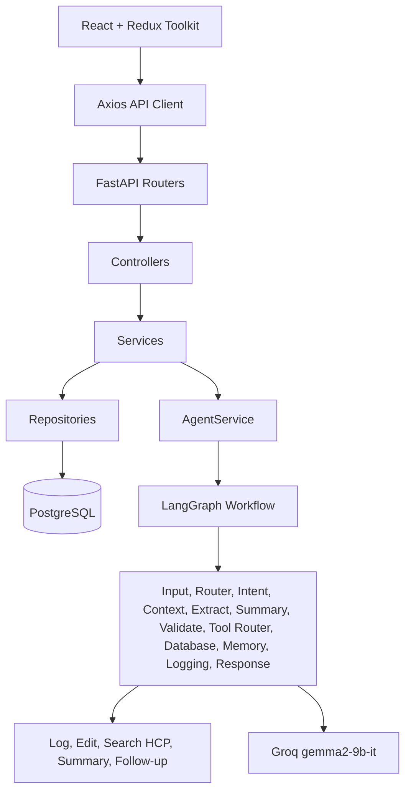

# Architecture

The module uses a layered backend and a feature-oriented frontend.

## Backend Boundaries

- Routers only parse HTTP inputs and delegate.
- Controllers translate route intent into service calls.
- Services coordinate business rules and transactions.
- Repositories own SQLAlchemy persistence.
- LangGraph nodes own AI workflow orchestration.
- Tools expose reusable CRM actions to the agent layer.

## Frontend Boundaries

- `pages/` compose workflows.
- `components/` hold reusable UI primitives and domain widgets.
- `redux/slices/` owns state per domain.
- `services/` owns Axios calls.
- `utils/validators/` owns Zod validation.
