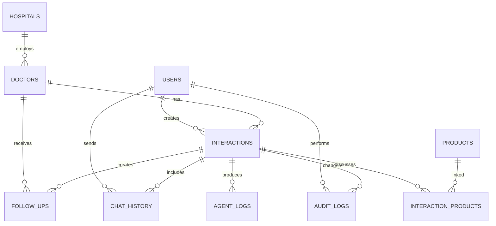

# Database Design

## Tables

- `users`: field representative identity and territory.
- `hospitals`: normalized hospital records.
- `doctors`: HCP profile linked to hospital.
- `products`: product catalog and therapeutic area.
- `interactions`: structured visit records and AI enrichment.
- `interaction_products`: normalized interaction/product relationship.
- `follow_ups`: recommendations and pending actions.
- `chat_history`: representative/assistant messages and extraction payloads.
- `agent_logs`: LangGraph node-level trace records.
- `audit_logs`: version history for create, update, and delete actions.
- `settings`: configurable enterprise behavior.
