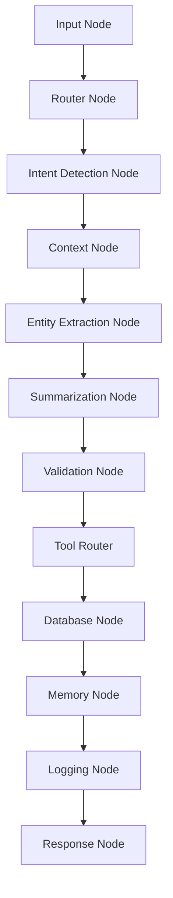

# LangGraph Workflow

## Nodes

- `input`: normalizes representative text.
- `router`: decides interaction capture vs general chat.
- `intent_detection`: detects log, edit, search, or summarize intent.
- `context`: retrieves HCP and hospital context.
- `entity_extraction`: calls Groq via the provider service.
- `summarization`: ensures CRM-ready summary text.
- `validation`: checks required structured fields and confidence.
- `tool_router`: chooses CRM tool behavior.
- `database`: persists only when save is explicitly requested.
- `memory`: stores chat history and extraction payloads.
- `logging`: writes agent trace logs.
- `response`: returns the final representative-facing message.
